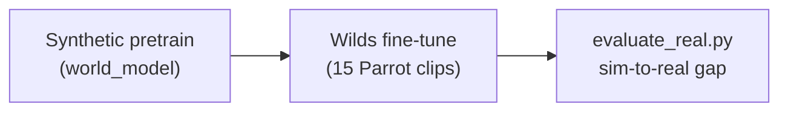
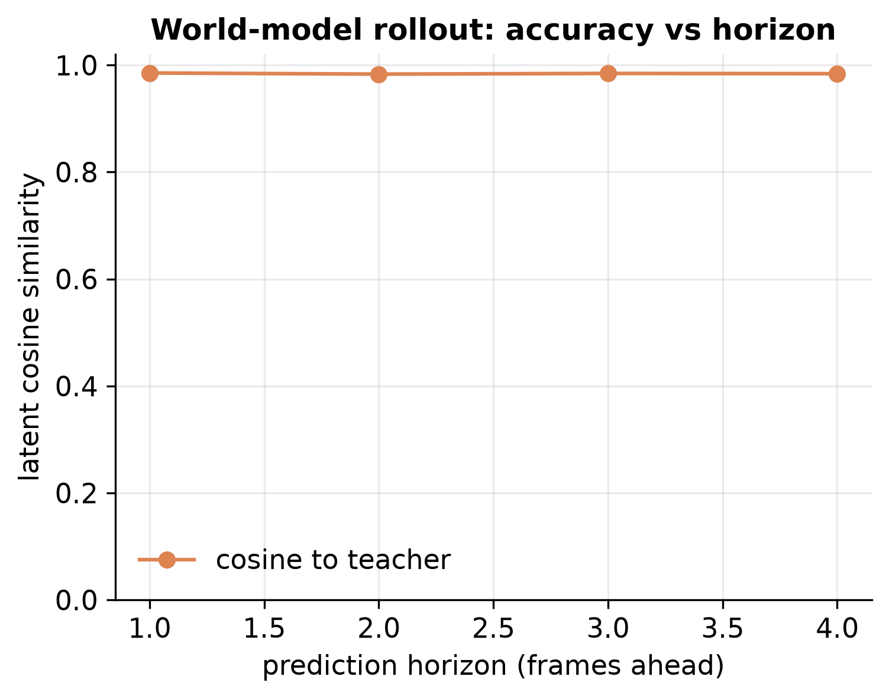
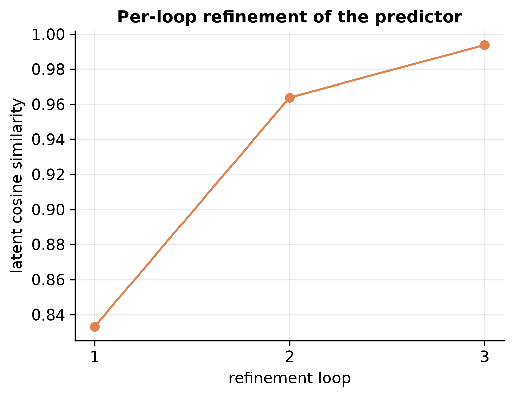
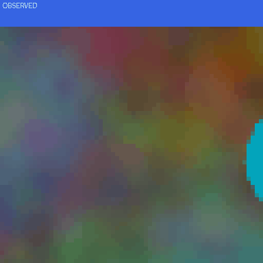
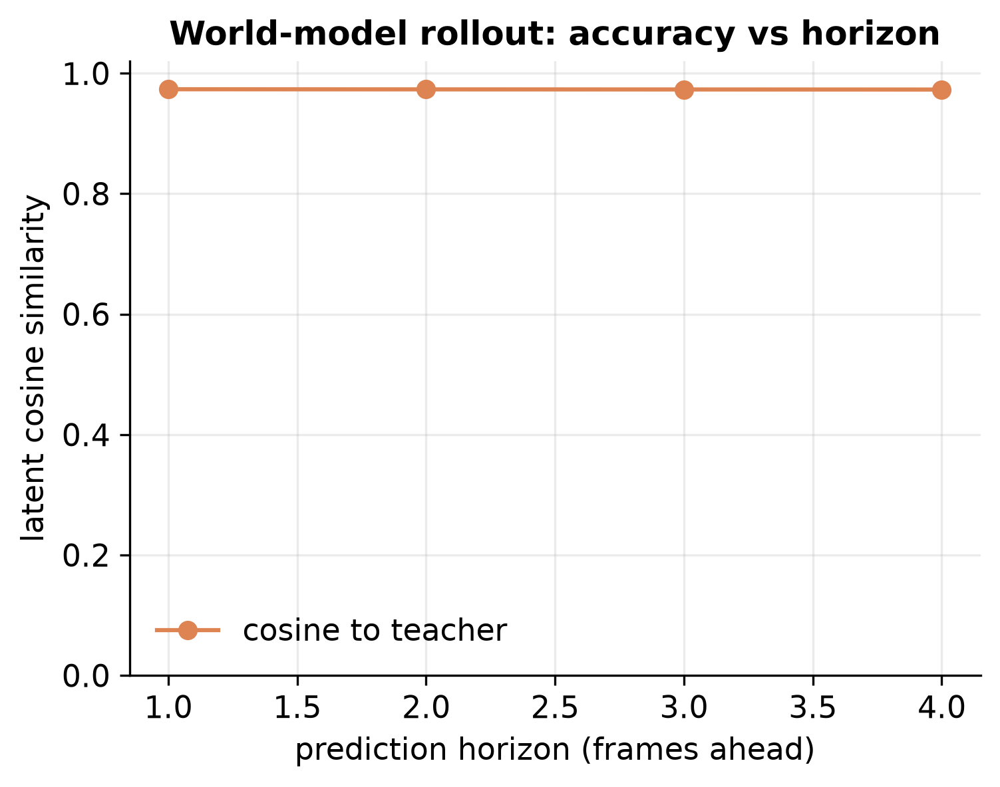
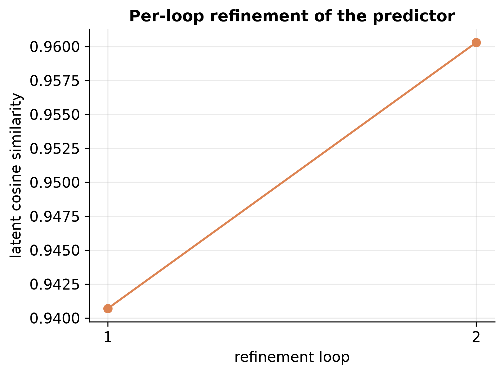
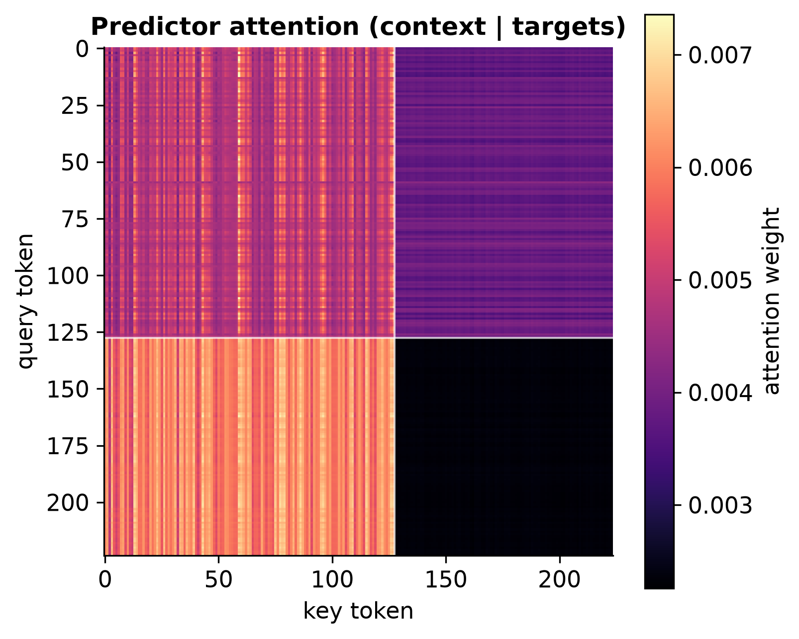
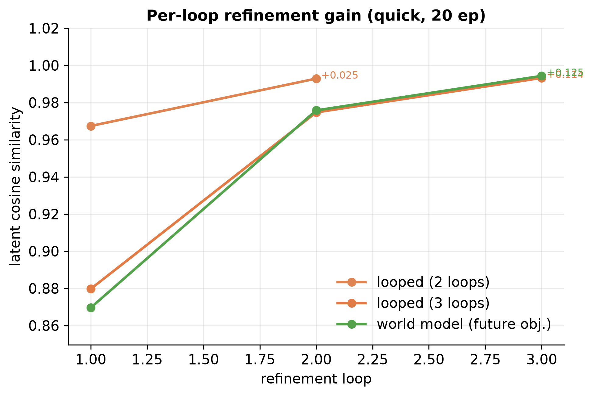
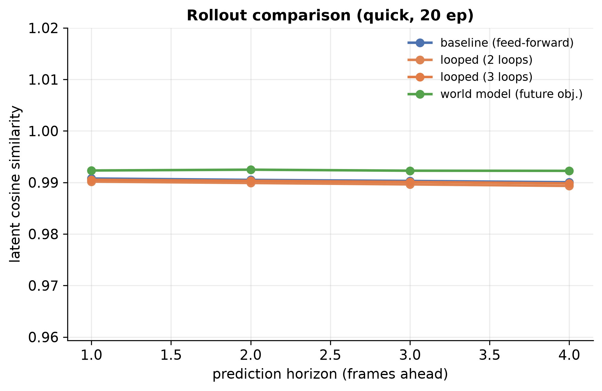
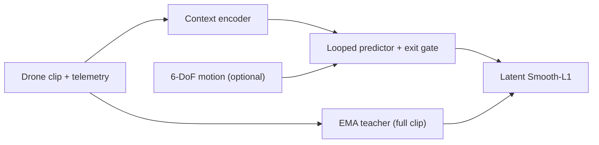

<div align="center">

# AeroJEPA: Video World Models for Quadrotor Egocentric Dynamics

**Video-JEPA for quadrotor egocentric dynamics: leak-free short-horizon metric
probing (0.1 s, \(\Delta t=0.025\,\mathrm{s}\)) on a rate+thrust plant, plus PyFlyt
closed-loop planning that fails on hard L-turns, without reconstructing pixels.
Action conditioning is in the checkpoint but does not pass true/zero/shuffle
tests yet.**

[](pyproject.toml)
[](pyproject.toml)
[](app.py)
[](configs/aerojepa_synth_base.yaml)
[](LICENSE)

[Quickstart](#installation--quickstart) ·
[Results](#key-results) ·
[Related work](#related-work) ·
[Sim-to-real](#sim-to-real-transfer) ·
[Gallery](#visual-gallery) ·
[Demo](#gradio-demo) ·
[Model cards](model_cards/) ·
[Report](REPORT.md) ·
[Eval protocol](docs/EVAL_PROTOCOL.md) ·
[Reproduce](REPRODUCTION.md)

Parent: [**looped-jepa**](https://github.com/JMangold0352/looped-jepa) · Closest paper: [**SkyJEPA**](https://arxiv.org/abs/2606.23444) (Rao et al., 2026)

</div>

---

## Overview

[SkyJEPA](https://arxiv.org/abs/2606.23444) (Rao, Zhang, Balestriero, LeCun, and Loianno, 2026)
is a *state*-history JEPA with a physics-inspired prober and outdoor MPPI control.
AeroJEPA is a *video*-JEPA on egocentric drone clips (optional 6-DoF action
channels); SkyJEPA’s own future work names RGB / RGB-D as the next step, which
is this project. We do not claim to beat SkyJEPA’s outdoor tracking RMSE, and
AeroProber short-horizon sim probe error (~0.006 m at 0.1 s) is not comparable
to SkyJEPA outdoor numbers (different horizon, \(\Delta t\), speed, and setting).

AeroJEPA extends [looped-jepa](https://github.com/JMangold0352/looped-jepa): predict
future latents from short egocentric clips. The repo includes synthetic training,
Wilds fine-tune, AeroProber metric decoding, a Gradio demo, and a PyFlyt
closed-loop planner (~3-5M params) behind a small `Vehicle` protocol
([`docs/VEHICLE.md`](docs/VEHICLE.md)). Controls in the prober plant are
**body-rate + thrust**, not four rotor forces.

**Action conditioning:** on `action_conditioned_wilds`, true / zero / shuffled
actions yield essentially the same latent cosine (~0.994). The AC checkpoint
doesn't respond to counterfactual actions yet; it remains the closed-loop default only because
planning needs an action-shaped interface. For representation claims, use
unconditioned `real_finetune_fast`.

**Default closed-loop stack (v1):**

```bash
python scripts/run_closed_loop_demo.py \
  --checkpoint checkpoints/action_conditioned_wilds/latest.pt \
  --residual-checkpoint checkpoints/action_residual_wilds/best.pt \
  --planner gradient --latent-smooth 0.05 --task hover
```

`action_conditioned_wilds_v2` / `action_residual_wilds_v2` are worse on protocol-B
real cosine (~0.915) and soft L-turn (33% on the bake-off), so they are not defaults.

---

## Related work

**SkyJEPA** (Rao et al., arXiv:2606.23444, 2026) - state-history JEPA + physics-inspired
prober + C++ MPPI on Orin NX, outdoor GPS. Project page:
https://pratyaksh10.github.io/skyjepa-project-page/

```bibtex
@article{rao2026skyjepa,
  title   = {SkyJEPA: Learning Long-Horizon World Models for Zero-Shot Sim-to-Real Control of Quadrotors},
  author  = {Rao, Pratyaksh and Zhang, Wancong and Balestriero, Randall and LeCun, Yann and Loianno, Giuseppe},
  journal = {arXiv preprint arXiv:2606.23444},
  year    = {2026},
  doi     = {10.48550/arXiv.2606.23444},
  url     = {https://arxiv.org/abs/2606.23444}
}
```

Also: I-JEPA (Assran et al., CVPR 2023), V-JEPA (Bardes et al. 2024), V-JEPA 2-AC
(Assran et al. 2025), parent [looped-jepa](https://github.com/JMangold0352/looped-jepa).

---

## Key results

Primary metrics are **action counterfactuals** (currently failing),
**compounding / metric RMSE vs horizon**, and **closed-loop success vs difficulty**
(see [`docs/EVAL_PROTOCOL.md`](docs/EVAL_PROTOCOL.md)). Latent cosine is a training
diagnostic. JSON under [`results/`](results/).

### Action counterfactuals (not yet causal)

On `action_conditioned_wilds` (`scripts/eval_action_counterfactual.py`), true /
zero / shuffled actions all give latent cosine ≈ **0.994**. The model does not
yet use actions for prediction.

### Closed-loop stress (v1, 10 seeds)

[`visualizations/closed_loop/stress_suite.json`](visualizations/closed_loop/stress_suite.json):
wind / recover / hover remain easy; **L-turn scale ×1.25 → 0% success** in the
difficulty sweep. Four-way L-turn action ablation
([`results/lturn_action_ablation.json`](results/lturn_action_ablation.json)):
at ×1.25, true/zero/shuffle = 20%/0%/10% (mixed; WM not a clean lever). Card:
[action Wilds](model_cards/aerojepa_action_wilds.md).

### Representation fine-tune - real aerial footage (`real_finetune_fast`)

Fine-tuned from synthetic pretrain on **15 Parrot clips** (The Wilds Drones; **128×128 on disk**, **64×64 model input**, 10 epochs, MPS). Checkpoint: [`checkpoints/real_finetune_fast/latest.pt`](checkpoints/real_finetune_fast/latest.pt).

| Metric | Value | Notes |
| --- | ---: | --- |
| **Latent cosine (real, protocol B)** | **0.974** | `scripts/evaluate_real.py` on `data/flights_128` |
| **Latent cosine (synthetic)** | **0.994** | Same script, synthetic branch |
| **Real rollout @ h=4** | **0.961** | Flat over horizon |
| **Sim-to-real gap** | **+0.019** | synth − real cosine |

Full eval: [`results/real_finetune_fast_eval.json`](results/real_finetune_fast_eval.json) · Protocol: [`docs/EVAL_PROTOCOL.md`](docs/EVAL_PROTOCOL.md)

### Closed-loop stack (v1 - default)

| Piece | Path |
| --- | --- |
| World model | `checkpoints/action_conditioned_wilds/latest.pt` |
| Residual | `checkpoints/action_residual_wilds/best.pt` |
| Planner | `--planner gradient --latent-smooth 0.05` |

Protocol-B real cosine for the WM alone is **~0.957** (weaker than unconditioned
`real_finetune_fast`). `*_wilds_v2` is worse and not the default.

### Synthetic pretrain (100 epochs, procedural benchmark)

| Model | Objective | Latent cosine | Rollout @ h=4 | Expected loops | Card |
| --- | --- | ---: | ---: | ---: | --- |
| **baseline** | masked | 0.954 | 0.917 | - | [base](model_cards/aerojepa_base.md) |
| **looped** | masked | **0.961** (+0.007) | 0.925 | 1.50 | [base](model_cards/aerojepa_base.md) |
| **world_model** | future | **0.981** | 0.973 | 1.75 | [world model](model_cards/aerojepa_world_model.md) |
| action_conditioned | future + 6-DoF | 0.980 | 0.975 | 1.75 | [world model](model_cards/aerojepa_world_model.md) |

**Headline gains (synthetic)**

- **Recurrence helps on video:** looped beats feed-forward baseline by **+0.7 pp** latent cosine.
- **Future objective learns:** rollout stays **flat ~0.97** over a 4-frame horizon.
- **Refinement pays off:** per-loop cosine **0.87 → 0.96 → 0.98**; exit gate averages **1.75** steps.
- **Action conditioning** is roughly tied with the unconditioned world model on synthetic data; real telemetry is the better test.

### Ablation suite (100 epochs, publication)

| Variant | Latent cosine | Rollout @ h=4 | Per-loop (1→last) |
| --- | ---: | ---: | --- |
| baseline | 0.953 | 0.917 | - |
| loops_2 | 0.960 | 0.925 | 0.941 → 0.960 |
| loops_3 | 0.963 | 0.928 | 0.841 → 0.962 |
| **world_model** | **0.981** | **0.973** | 0.869 → 0.981 |

Details: [`results/ablations/summary.json`](results/ablations/summary.json) · [REPORT.md](REPORT.md)

---

## Sim-to-real transfer

Synthetic pretrain → Wilds Parrot fine-tune is the supported path. Optional
personal Tello capture scripts exist for future work; they are **not** a required
pipeline stage.



| Stage | Data | Config | Output |
| --- | --- | --- | --- |
| **1. Synthetic** | Procedural drone clips (no download) | `aerojepa_world_model.yaml` | `checkpoints/world_model/latest.pt` |
| **2. Wilds** | [The Wilds Drones](https://huggingface.co/datasets/imageomics/thewilds_drones) (Parrot MP4 + telemetry) | `aerojepa_finetune_fast.yaml` | `checkpoints/real_finetune_fast/latest.pt` |

**Measured transfer (Wilds, protocol B):** real latent cosine **0.974**, synthetic **0.994**, gap **+0.019** (`docs/EVAL_PROTOCOL.md`).

```bash
python scripts/evaluate_real.py \
    --checkpoint checkpoints/real_finetune_fast/latest.pt \
    --data-dir data/flights_128

python scripts/run_transfer_curve.py --device mps
# → results/transfer_curve/transfer_curve.png
```

Data layout: [`data/README.md`](data/README.md). Optional Tello helpers: `scripts/tello_workflow.sh` (future).

---

## Visual gallery

All figures at **300 DPI** (PNG) or animated GIF. Regenerate from checkpoints, then refresh [`docs/gallery/`](docs/gallery/) for README embeds - see [`docs/gallery/README.md`](docs/gallery/README.md).

### Real-data world model (`real_finetune_fast`)

<table>
<tr>
<td align="center" width="50%">

**Rollout on real Parrot footage**

Flat cosine over a 4-frame horizon after Wilds fine-tune.



</td>
<td align="center" width="50%">

**Per-loop refinement (real data)**

Coarse → refined latent prediction: **0.83 → 0.96 → 0.99**.



</td>
</tr>
<tr>
<td align="center" width="50%">

**Latent planner - hover**

Imagined rollout on the real-data checkpoint (coherence **1.000**).



</td>
<td align="center" width="50%">

**Latent planner - waypoint**

Kinematic cost search in latent space (coherence **1.000**).


</td>
</tr>
</table>

### Synthetic pretrain & ablations

<table>
<tr>
<td align="center" width="50%">

**World-model rollout (synthetic)**

Healthy forward model signature - no horizon cliff.



</td>
<td align="center" width="50%">

**Per-loop refinement (looped)**

Each extra loop improves latent prediction.



</td>
</tr>
<tr>
<td align="center" width="50%">

**Predictor attention across time**

Self-attention with frame boundaries.



</td>
<td align="center" width="50%">

**Latent planner (synthetic checkpoint)**

Observed context → imagined rollout → plan.


</td>
</tr>
<tr>
<td align="center" colspan="2">

**Ablation comparison** - per-loop gain + rollout curves


&nbsp;&nbsp;


</td>
</tr>
</table>

Full figure sets: [`visualizations/figures/`](visualizations/figures/) · Planner outputs: [`visualizations/planner/`](visualizations/planner/)

```bash
python scripts/visualize.py --checkpoint checkpoints/real_finetune_fast/latest.pt \
  --out-dir visualizations/figures/real_finetune_fast
python scripts/run_planner_demo.py --checkpoint checkpoints/real_finetune_fast/latest.pt --task waypoint
python scripts/run_planner_demo.py --checkpoint checkpoints/real_finetune_fast/latest.pt --task hover
```

---

## Installation & quickstart

```bash
git clone https://github.com/JMangold0352/aerojepa.git && cd aerojepa
python -m venv .venv && source .venv/bin/activate
pip install -r requirements.txt        # or: pip install -e .

python scripts/verify_install.py
pytest -q
```

No GPU required. Auto-selects **MPS** (Apple Silicon), CUDA, or CPU.

**Released weights** — `world_model` and `real_finetune_fast` on Hugging Face
(see [`released_weights/`](released_weights/)). Not in git. Action-conditioned
Wilds is not released because counterfactuals fail.

```bash
pip install -e ".[hf]"                 # optional: huggingface_hub
./scripts/download_weights.sh --list
./scripts/download_weights.sh world_model
```

**Load encoder in Python**

```python
import torch
from aerojepa.eval import load_model, load_pretrained

model, cfg = load_pretrained("world_model", torch.device("cpu"))
# or a local path:
# model, cfg = load_model("checkpoints/real_finetune_fast/latest.pt", torch.device("cpu"))
clip = torch.rand(1, cfg["data"]["num_frames"], 3, cfg["data"]["img_size"], cfg["data"]["img_size"])
features = model.encoder.forward_all_patches(clip)   # (1, T*S, D)
```

### Workflow A - Synthetic (zero downloads)

Train the full model ladder on procedural drone clips:

```bash
python scripts/train.py --config configs/aerojepa_baseline.yaml
python scripts/train.py --config configs/aerojepa_looped.yaml
python scripts/train.py --config configs/aerojepa_world_model.yaml
python scripts/evaluate.py --checkpoint checkpoints/world_model/latest.pt
python scripts/compare_baseline.py \
  --baseline-checkpoint checkpoints/baseline/latest.pt \
  --looped-checkpoint  checkpoints/looped/latest.pt
```

### Workflow B - Real footage (Wilds Parrot)

Ingest public aerial data, preprocess, fine-tune from synthetic pretrain:

```bash
# Convert HuggingFace Wilds clips → data/flights/
python scripts/convert_wilds.py --input-dir data/raw/thewilds --output-dir data/flights

# Standardize to 128×128 on disk / 15 fps (model still trains at img_size=64)
python scripts/preprocess_real.py --input-dir data/flights \
  --output-dir data/flights_128 --target-fps 15 --max-seconds 60 --square --resize 128

# Optional: fast frame-index selection via Rust (OpenCV still decodes/encodes)
#   curl https://sh.rustup.rs -sSf | sh && source "$HOME/.cargo/env"
#   uv pip install maturin && cd native/aerojepa-preprocess && maturin develop --release
#   python scripts/preprocess_real.py ... --backend auto   # uses Rust when installed
# See docs/NATIVE_PREPROCESS.md

# Fine-tune (~4 min on MPS for 10 epochs)
python scripts/train.py --config configs/aerojepa_finetune_fast.yaml --device mps

# Sim-to-real gap
python scripts/evaluate_real.py --checkpoint checkpoints/real_finetune_fast/latest.pt \
  --data-dir data/flights_128
```

Long runs: [`scripts/launch_training.sh`](scripts/launch_training.sh) · Resume: `--resume checkpoints/.../latest.pt`

### Workflow C - Personal Tello footage

Record-only capture (never commands flight). One command runs preflight → four tagged maneuvers → preprocess → fine-tune → transfer report:

```bash
pip install djitellopy opencv-python

./scripts/tello_workflow.sh preflight          # Wi-Fi, battery, deps
./scripts/tello_workflow.sh all --duration 30  # full pipeline

# Or step by step:
./scripts/tello_workflow.sh sessions --duration 30   # hover, forward, turn, altitude
./scripts/tello_workflow.sh preprocess               # → data/flights_tello_128/
./scripts/tello_workflow.sh train                    # from real_finetune_fast
./scripts/tello_workflow.sh report                   # vs Wilds-only baseline
```

Safety: the capture script **records only** - you fly manually. See [`data/README.md`](data/README.md).

All CLIs: [`scripts/README.md`](scripts/README.md) · Configs inherit from [`configs/aerojepa_synth_base.yaml`](configs/aerojepa_synth_base.yaml).

---

## Gradio demo

Interactive world-model demo: generate a synthetic flight, choose context frames and refinement loops, watch prediction quality respond. **Run Latent Planner** tab imagines action plans and renders the outcome.

```bash
pip install gradio
./scripts/download_weights.sh world_model
python app.py --checkpoint checkpoints/world_model/latest.pt
# → http://127.0.0.1:7860
```

```python
import torch
from aerojepa.eval import load_pretrained

model, cfg = load_pretrained("world_model", torch.device("cpu"))
```

`python app.py` with no `--checkpoint` tries the same `world_model` download;
if URLs are still placeholders it falls back to the untrained smoke model.

| | |
| --- | --- |
| **Local** | [`app.py`](app.py) · [`demo/README.md`](demo/README.md) |
| **Planner CLI** | `python scripts/run_planner_demo.py --checkpoint checkpoints/real_finetune_fast/latest.pt --task waypoint` |
| **Closed-loop (default stack)** | `python scripts/run_closed_loop_demo.py --checkpoint checkpoints/action_conditioned_wilds/latest.pt --residual-checkpoint checkpoints/action_residual_wilds/best.pt --planner gradient --latent-smooth 0.05 --task hover` |
| **Closed-loop waypoint** | same stack, `--task waypoint --goal 0.6 0 0` |
| **Closed-loop recover** | same stack, `--task recover` |
| **Demo reel** | `python scripts/stitch_closed_loop_demo.py --include-random` → `docs/gallery/closed_loop_demo_reel.gif` |

---

## Why the small model

Design targets that show up throughout the stack:

- Forward prediction in latent space (anticipate, don’t just classify)
- Synthetic → Wilds → Tello transfer, with a measured gap at each step
- Latent planning before execution (research demos in PyFlyt)
- Self-supervised pretrain; fine-tune from a small clip set
- Exit gate spends compute on hard moments only
- ~3-5M params so experiments stay cheap on a laptop

This is research code, not a deployed flight system.

---

## How it works



Two objectives, one network - only the mask collator changes:

- **`masked`** - scattered hidden patches (representation learning)
- **`future`** - predict upcoming frame latents (forward world model)

Deep dive: [`docs/TECHNICAL_REPORT.md`](docs/TECHNICAL_REPORT.md)

---

## Model cards

Per-model documentation: architecture, training recipe, metrics, limitations, and load-and-run snippets.

| Card | Summary |
| --- | --- |
| [**aerojepa_base**](model_cards/aerojepa_base.md) | Baseline + looped masked objective, recurrence gains |
| [**aerojepa_world_model**](model_cards/aerojepa_world_model.md) | Future-frame objective, rollout, action conditioning |
| [**aerojepa_real_finetune**](model_cards/aerojepa_real_finetune.md) | Unconditioned Wilds fine-tune (`real_finetune_fast`) |
| [**aerojepa_action_wilds**](model_cards/aerojepa_action_wilds.md) | Action-conditioned Wilds + residual closed-loop stack |
| [**Index**](model_cards/README.md) | All cards |

---

## Limitations

| Limitation | Status |
| --- | --- |
| Closed-loop is a research demo | PyFlyt via `Vehicle` protocol + heuristic map + small residual; not a flight controller ([`docs/VEHICLE.md`](docs/VEHICLE.md)) |
| Action-conditioned Wilds | Counterfactuals fail (true≈zero≈shuffle); action conditioning not validated |
| Hard L-turn | Stress suite: scale ×1.25 → 0% success (10 seeds) |
| AeroProber ~0.006 m tables | Trained **before** PyFlyt GT unit/frame fix; see [`docs/CORRECTNESS.md`](docs/CORRECTNESS.md) |
| Looped vs regular (prober) | **Tie** on structured metric RMSE |
| Checkpoints | Local artifacts; not in git ([REPRODUCTION.md](REPRODUCTION.md)) |
| Onboard / ROS / motor-command hardware | Out of scope |
| Personal Tello footage | Optional future capture; not part of the published pipeline |

Experiment log: [`REPORT.md`](REPORT.md). Prober note: [`research/prober/note.md`](research/prober/note.md).

---

## Repository layout

```
aerojepa/
├── src/aerojepa/       models · data · train · eval · viz · sim
├── configs/            synthetic · real · finetune · tello
├── scripts/            train · evaluate · tello_workflow · visualize · planner
├── docs/gallery/       README-embedded figures (tracked)
├── app.py · demo/      Gradio demo + latent planner tab
├── model_cards/        per-model documentation
├── results/            JSON metrics (tracked); checkpoints/ runs/ data/ gitignored
└── docs/               technical notes · gallery
```

---

## Citation

```bibtex
@misc{mangold2026aerojepa,
  title        = {AeroJEPA: Recurrent Video World Models for Embodied UAV Autonomy},
  author       = {John Mangold},
  year         = {2026},
  howpublished = {\url{https://github.com/JMangold0352/aerojepa}},
  note         = {Video JEPA with weight-shared recurrent predictor, extending looped-jepa}
}
```

**Acknowledgments** - [SkyJEPA](https://arxiv.org/abs/2606.23444) (Rao et al. 2026) ·
[I-JEPA](https://arxiv.org/abs/2301.08243) · [Vision Transformer](https://arxiv.org/abs/2010.11929) ·
[looped-jepa](https://github.com/JMangold0352/looped-jepa) ·
[The Wilds Drones](https://huggingface.co/datasets/imageomics/thewilds_drones)

---

## Documentation index

| Doc | Contents |
| --- | --- |
| [docs/NATIVE_PREPROCESS.md](docs/NATIVE_PREPROCESS.md) | Optional Rust frame-index helper (deferred beyond Phase A) |
| [docs/EVAL_PROTOCOL.md](docs/EVAL_PROTOCOL.md) | How published metrics are produced |
| [docs/CORRECTNESS.md](docs/CORRECTNESS.md) | Leak / frames / controls / attitude checklist |
| [docs/TECHNICAL_REPORT.md](docs/TECHNICAL_REPORT.md) | Architecture and design notes |
| [research/prober/note.md](research/prober/note.md) | AeroProber technical note |
| [data/README.md](data/README.md) | Real footage layout, preprocess |
| [REPRODUCTION.md](REPRODUCTION.md) | Reproduce from scratch |
| [REPORT.md](REPORT.md) | Experiment log |
| [results/README.md](results/README.md) | Metrics index |
| [scripts/README.md](scripts/README.md) · [visualizations/README.md](visualizations/README.md) · [demo/README.md](demo/README.md) | Component guides |

---

## License

[MIT](LICENSE) - Copyright (c) 2025 John Mangold.
