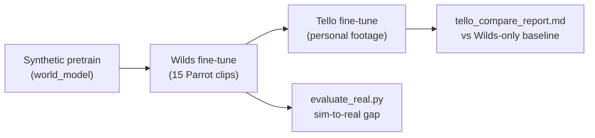
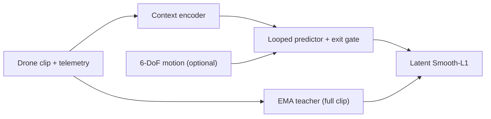

<div align="center">

# AeroJEPA: Recurrent Video World Models for Embodied UAV Autonomy

**A compact video-JEPA world model for drones — extending the [looped-jepa](https://github.com/JMangold0352/looped-jepa) recurrent predictor from single images into space and time.**

[](pyproject.toml)
[](pyproject.toml)
[](app.py)
[](configs/aerojepa_synth_base.yaml)
[](results/real_finetune_fast_eval.json)
[](#license)

*Self-supervised video encoders · latent future prediction · adaptive-depth recurrence · sim-to-real on aerial footage · latent-space planning*

**Current best checkpoint:** `checkpoints/real_finetune_fast/latest.pt` — **0.994** latent cosine · **0.984** rollout @ 4 frames · **+0.019** sim-to-real gap on held-out Parrot clips · latent planner coherence **1.000** on hover / waypoint tasks.

[Quickstart](#installation--quickstart) ·
[Results](#key-results) ·
[Sim-to-real](#sim-to-real-transfer) ·
[Gallery](#visual-gallery) ·
[Demo](#gradio-demo) ·
[Model cards](model_cards/) ·
[Report](REPORT.md) ·
[Reproduce](REPRODUCTION.md)

Parent project: [**looped-jepa**](https://github.com/JMangold0352/looped-jepa)

</div>

---

## Hook

**Video-JEPA** learns to predict the *latent structure* of what comes next in a drone clip — not pixels, not contrastive negatives. AeroJEPA asks the autonomy-relevant question:

> *Can a weight-shared recurrent predictor, with a learned exit gate, turn short egocentric video into a forward world model suitable for planning under motion — and transfer that model from synthetic pretraining to real aerial footage?*

This repository ships a full research stack: four synthetic model variants, a procedural benchmark (**zero downloads**), real-data ingestion (The Wilds Drones + personal Tello workflow), ablation and visualization pipelines, an interactive Gradio demo, and a **latent-space planner**. The encoder stays under **~5M parameters** — sized for edge iteration, not datacenter scale.

---

## Key results

Official metric: **latent cosine similarity** between the predictor and EMA teacher on held-out clips (higher is better). JSON metrics: [`results/`](results/).

### Best model — real aerial footage (`real_finetune_fast`)

Fine-tuned from synthetic pretrain on **15 Parrot clips** (The Wilds Drones, 128×128, 10 epochs, MPS). Checkpoint: [`checkpoints/real_finetune_fast/latest.pt`](checkpoints/real_finetune_fast/latest.pt).

| Metric | Value | Notes |
| --- | ---: | --- |
| **Latent cosine** | **0.994** | Validation on preprocessed Wilds clips |
| **Rollout @ h=4** | **0.984** | Flat over horizon — healthy world model |
| **Per-loop refinement** | **0.83 → 0.96 → 0.99** | Exit gate expected depth **1.75** loops |
| **Sim-to-real gap** | **+0.019** | Held-out real vs in-val synthetic reference |
| **Planner coherence** | **1.000** | Hover + waypoint on real-data checkpoint |

Full eval: [`results/real_finetune_fast_eval.json`](results/real_finetune_fast_eval.json) · Figures: [`visualizations/figures/real_finetune_fast/`](visualizations/figures/real_finetune_fast/)

### Synthetic pretrain (100 epochs, procedural benchmark)

| Model | Objective | Latent cosine | Rollout @ h=4 | Expected loops | Card |
| --- | --- | ---: | ---: | ---: | --- |
| **baseline** | masked | 0.954 | 0.917 | — | [base](model_cards/aerojepa_base.md) |
| **looped** | masked | **0.961** (+0.007) | 0.925 | 1.50 | [base](model_cards/aerojepa_base.md) |
| **world_model** | future | **0.981** | 0.973 | 1.75 | [world model](model_cards/aerojepa_world_model.md) |
| action_conditioned | future + 6-DoF | 0.980 | 0.975 | 1.75 | [world model](model_cards/aerojepa_world_model.md) |

**Headline gains (synthetic)**

- **Recurrence helps on video:** looped beats feed-forward baseline by **+0.7 pp** latent cosine.
- **Future objective learns:** rollout stays **flat ~0.97** over a 4-frame horizon.
- **Refinement pays off:** per-loop cosine **0.87 → 0.96 → 0.98**; exit gate averages **1.75** steps.
- **Action conditioning** ties the unconditioned world model on synthetic data; real telemetry is the honest test.

### Ablation suite (20 epochs, controlled variants)

| Variant | Latent cosine | Rollout @ h=4 | Per-loop gain |
| --- | ---: | ---: | --- |
| baseline | 0.993 | 0.990 | — |
| loops_2 | 0.993 | 0.989 | +0.025 |
| loops_3 | 0.993 | 0.990 | +0.112 |
| **world_model** | **0.994** | **0.992** | +0.124 |

Details: [`results/ablations/summary.json`](results/ablations/summary.json) · [REPORT.md](REPORT.md)

---

## Sim-to-real transfer

AeroJEPA closes the synthetic → real loop in three stages. Each stage reuses the same `(frames, actions)` training interface — only the data source changes.



| Stage | Data | Config | Output |
| --- | --- | --- | --- |
| **1. Synthetic** | Procedural drone clips (no download) | `aerojepa_world_model.yaml` | `checkpoints/world_model/latest.pt` |
| **2. Wilds** | [The Wilds Drones](https://huggingface.co/datasets/imageomics/thewilds_drones) (Parrot MP4 + telemetry) | `aerojepa_finetune_fast.yaml` | `checkpoints/real_finetune_fast/latest.pt` |
| **3. Tello** | Self-captured sessions (hover, forward, turn, altitude) | `aerojepa_finetune_tello.yaml` | `checkpoints/real_finetune_tello/latest.pt` |

**Measured transfer (Wilds stage):** latent cosine **0.994** on validation clips; **0.974** on held-out real evaluation; gap **+0.019** — small enough to show the world model generalizes, large enough to quantify what personal fine-tuning should close.

```bash
# Report sim-to-real gap for any checkpoint
python scripts/evaluate_real.py \
    --checkpoint checkpoints/real_finetune_fast/latest.pt \
    --data-dir data/flights_128

# After Tello fine-tune: compare vs Wilds-only baseline
python scripts/tello_compare_report.py
# → results/tello_transfer_report.md

# Transfer curve (data volume vs gap / rollout):
python scripts/run_transfer_curve.py --device mps
# → results/transfer_curve/transfer_curve.png
```

One-command Tello pipeline: [`scripts/tello_workflow.sh`](scripts/tello_workflow.sh) · Data layout: [`data/README.md`](data/README.md)

---

## Visual gallery

All figures at **300 DPI** (PNG) or animated GIF. Regenerate from checkpoints, then refresh [`docs/gallery/`](docs/gallery/) for README embeds — see [`docs/gallery/README.md`](docs/gallery/README.md).

### Real-data world model (`real_finetune_fast`)

<table>
<tr>
<td align="center" width="50%">

**Rollout on real Parrot footage**

Flat cosine over a 4-frame horizon after Wilds fine-tune.


</td>
<td align="center" width="50%">

**Per-loop refinement (real data)**

Coarse → refined latent prediction: **0.83 → 0.96 → 0.99**.


</td>
</tr>
<tr>
<td align="center" width="50%">

**Latent planner — hover**

Imagined rollout on the real-data checkpoint (coherence **1.000**).


</td>
<td align="center" width="50%">

**Latent planner — waypoint**

Kinematic cost search in latent space (coherence **1.000**).


</td>
</tr>
</table>

### Synthetic pretrain & ablations

<table>
<tr>
<td align="center" width="50%">

**World-model rollout (synthetic)**

Healthy forward model signature — no horizon cliff.


</td>
<td align="center" width="50%">

**Per-loop refinement (looped)**

Each extra loop improves latent prediction.


</td>
</tr>
<tr>
<td align="center" width="50%">

**Predictor attention across time**

Self-attention with frame boundaries.


</td>
<td align="center" width="50%">

**Latent planner (synthetic checkpoint)**

Observed context → imagined rollout → plan.


</td>
</tr>
<tr>
<td align="center" colspan="2">

**Ablation comparison** — per-loop gain + rollout curves


&nbsp;&nbsp;


</td>
</tr>
</table>

Full figure sets: [`visualizations/figures/`](visualizations/figures/) · Planner outputs: [`visualizations/planner/`](visualizations/planner/)

```bash
python scripts/visualize.py --checkpoint checkpoints/real_finetune_fast/latest.pt \
  --out-dir visualizations/figures/real_finetune_fast
python scripts/run_planner_demo.py --checkpoint checkpoints/real_finetune_fast/latest.pt --task waypoint
python scripts/run_planner_demo.py --checkpoint checkpoints/real_finetune_fast/latest.pt --task hover
```

---

## Installation & quickstart

```bash
git clone https://github.com/JMangold0352/aerojepa.git && cd aerojepa
python -m venv .venv && source .venv/bin/activate
pip install -r requirements.txt        # or: pip install -e .

python scripts/verify_install.py
pytest -q
```

No GPU required. Auto-selects **MPS** (Apple Silicon), CUDA, or CPU.

**Load encoder in Python**

```python
import torch
from aerojepa.eval import load_model

model, cfg = load_model("checkpoints/real_finetune_fast/latest.pt", torch.device("cpu"))
clip = torch.rand(1, cfg["data"]["num_frames"], 3, cfg["data"]["img_size"], cfg["data"]["img_size"])
features = model.encoder.forward_all_patches(clip)   # (1, T*S, D)
```

### Workflow A — Synthetic (zero downloads)

Train the full model ladder on procedural drone clips:

```bash
python scripts/train.py --config configs/aerojepa_baseline.yaml
python scripts/train.py --config configs/aerojepa_looped.yaml
python scripts/train.py --config configs/aerojepa_world_model.yaml
python scripts/evaluate.py --checkpoint checkpoints/world_model/latest.pt
python scripts/compare_baseline.py \
  --baseline-checkpoint checkpoints/baseline/latest.pt \
  --looped-checkpoint  checkpoints/looped/latest.pt
```

### Workflow B — Real footage (Wilds Parrot)

Ingest public aerial data, preprocess, fine-tune from synthetic pretrain:

```bash
# Convert HuggingFace Wilds clips → data/flights/
python scripts/convert_wilds.py --input-dir data/raw/thewilds --output-dir data/flights

# Standardize to 128×128 / 15 fps
python scripts/preprocess_real.py --input-dir data/flights \
  --output-dir data/flights_128 --target-fps 15 --max-seconds 60 --square --resize 128

# Fine-tune (~4 min on MPS for 10 epochs)
python scripts/train.py --config configs/aerojepa_finetune_fast.yaml --device mps

# Sim-to-real gap
python scripts/evaluate_real.py --checkpoint checkpoints/real_finetune_fast/latest.pt \
  --data-dir data/flights_128
```

Long runs: [`scripts/launch_training.sh`](scripts/launch_training.sh) · Resume: `--resume checkpoints/.../latest.pt`

### Workflow C — Personal Tello footage

Record-only capture (never commands flight). One command runs preflight → four tagged maneuvers → preprocess → fine-tune → transfer report:

```bash
pip install djitellopy opencv-python

./scripts/tello_workflow.sh preflight          # Wi-Fi, battery, deps
./scripts/tello_workflow.sh all --duration 30  # full pipeline

# Or step by step:
./scripts/tello_workflow.sh sessions --duration 30   # hover, forward, turn, altitude
./scripts/tello_workflow.sh preprocess               # → data/flights_tello_128/
./scripts/tello_workflow.sh train                    # from real_finetune_fast
./scripts/tello_workflow.sh report                   # vs Wilds-only baseline
```

Safety: the capture script **records only** — you fly manually. See [`data/README.md`](data/README.md).

All CLIs: [`scripts/README.md`](scripts/README.md) · Configs inherit from [`configs/aerojepa_synth_base.yaml`](configs/aerojepa_synth_base.yaml).

---

## Gradio demo

Interactive world-model demo: generate a synthetic flight, choose context frames and refinement loops, watch prediction quality respond. **Run Latent Planner** tab imagines action plans and renders the outcome.

```bash
pip install gradio
python app.py --checkpoint checkpoints/world_model/latest.pt
# → http://127.0.0.1:7860
```

| | |
| --- | --- |
| **Local** | [`app.py`](app.py) · [`demo/README.md`](demo/README.md) |
| **Planner CLI** | `python scripts/run_planner_demo.py --checkpoint checkpoints/real_finetune_fast/latest.pt --task waypoint` |

---

## Defense, autonomy & edge AI

The core constraints in this project — compact models, label efficiency, adaptive compute, and interpretable inference — align directly with autonomous and defense perception systems.

| Theme | Connection |
| --- | --- |
| **Predictive autonomy** | Forward world model anticipates scene structure ahead of the aircraft — foundation for obstacle anticipation |
| **Sim-to-real pipeline** | Synthetic pretrain → public Parrot fine-tune → personal Tello adaptation, with measured gap at each stage |
| **Model-based control** | Latent planner imagines maneuvers before execution; action conditioning ready for real 6-DoF telemetry |
| **Label efficiency** | Self-supervised pretraining on unlabeled flight video; fine-tune from a small clip corpus |
| **Adaptive compute** | Exit gate spends recurrent depth only on hard moments — relevant for latency-budgeted edge inference |
| **Interpretability** | Rollout curves, per-loop refinement, exit-depth distributions, attention-over-time |
| **Edge readiness** | **~3–5M params** targets embedded inference after mission-specific adaptation |

This is research code, not a deployed flight system.

---

## How it works



Two objectives, one network — only the mask collator changes:

- **`masked`** — scattered hidden patches (representation learning)
- **`future`** — predict upcoming frame latents (forward world model)

Deep dive: [`docs/TECHNICAL_REPORT.md`](docs/TECHNICAL_REPORT.md)

---

## Model cards

Per-model documentation: architecture, training recipe, metrics, limitations, and load-and-run snippets.

| Card | Summary |
| --- | --- |
| [**aerojepa_base**](model_cards/aerojepa_base.md) | Baseline + looped masked objective, recurrence gains |
| [**aerojepa_world_model**](model_cards/aerojepa_world_model.md) | Future-frame objective, rollout, action conditioning |
| [**Index**](model_cards/README.md) | All cards |

---

## Limitations & next steps

**Current limitations (stated plainly)**

| Limitation | Status |
| --- | --- |
| **No closed-loop flight** | Research code, not a flight controller; PyFlyt hooks are scaffolded |
| **Action conditioning** did not separate on synthetic data | Needs reliable real 6-DoF telemetry |
| **Tello fine-tune** | Workflow ready; personal footage not yet in published checkpoint |
| **Checkpoints** | Local artifacts; not shipped via git (see [REPRODUCTION.md](REPRODUCTION.md)) |

**Next steps**

1. **Tello sessions** — `./scripts/tello_workflow.sh all` → close the personal-data loop
2. **Closed-loop sim** — wire [`src/aerojepa/sim/planner.py`](src/aerojepa/sim/planner.py) into PyFlyt hover / waypoint tasks
3. **Transfer curve** — fine-tune on 1/5/15 clips; plot gap closing for README
4. **Publication ablation** — `python scripts/run_ablations.py --mode full`

Roadmap: [`docs/ROADMAP.md`](docs/ROADMAP.md) · Experiment log: [`REPORT.md`](REPORT.md)

---

## Repository layout

```
aerojepa/
├── src/aerojepa/       models · data · train · eval · viz · sim
├── configs/            synthetic · real · finetune · tello
├── scripts/            train · evaluate · tello_workflow · visualize · planner
├── docs/gallery/       README-embedded figures (tracked)
├── app.py · demo/      Gradio demo + latent planner tab
├── model_cards/        per-model documentation
├── results/            JSON metrics (tracked); checkpoints/ runs/ data/ gitignored
└── docs/               technical report · roadmap
```

---

## Citation

```bibtex
@misc{mangold2026aerojepa,
  title        = {AeroJEPA: Recurrent Video World Models for Embodied UAV Autonomy},
  author       = {John Mangold},
  year         = {2026},
  howpublished = {\url{https://github.com/JMangold0352/aerojepa}},
  note         = {Video JEPA with weight-shared recurrent predictor, extending looped-jepa}
}
```

**Acknowledgments** — [I-JEPA](https://arxiv.org/abs/2301.08243) · [Vision Transformer](https://arxiv.org/abs/2010.11929) · [looped-jepa](https://github.com/JMangold0352/looped-jepa) · [The Wilds Drones](https://huggingface.co/datasets/imageomics/thewilds_drones)

---

## Documentation index

| Doc | Contents |
| --- | --- |
| [docs/TECHNICAL_REPORT.md](docs/TECHNICAL_REPORT.md) | Architecture and design rationale |
| [data/README.md](data/README.md) | Real footage layout, Tello safety, preprocess |
| [docs/ROADMAP.md](docs/ROADMAP.md) | Five-phase plan |
| [REPRODUCTION.md](REPRODUCTION.md) | Reproduce from scratch |
| [REPORT.md](REPORT.md) | Experiment log and honest negatives |
| [results/README.md](results/README.md) | Metrics index |
| [scripts/README.md](scripts/README.md) · [visualizations/README.md](visualizations/README.md) · [demo/README.md](demo/README.md) | Component guides |

---

## License

Research and educational use. See config headers for experiment lineage.
